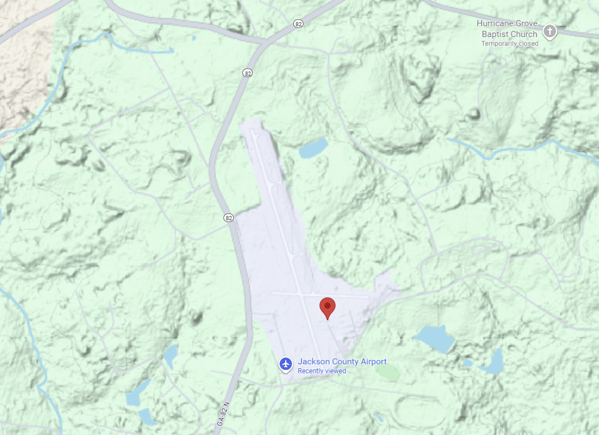

# 🌦️ Weather Prediction Pipeline

Real-Time Weather ETL + Feature Engineering + Forecasting + Classification
with PySpark, MLflow, FastAPI, Prefect, and Streamlit

### 📌 Project Overview

This project demonstrates a full production-grade data engineering + data science pipeline built around the Open-Meteo Weather API. It showcases:
- Real-time JSON ingestion
- A clean Bronze → Silver → Gold data lakehouse architecture
- Automated PySpark ETL
- Time-series forecasting & rain/no-rain classification
- Model tracking with MLflow
- API deployment with FastAPI
- A Streamlit dashboard for real-time visualization

This project is designed as a portfolio-quality, end-to-end system suitable for demonstrating engineering and modeling skills.

### 🎯 Objectives
#### 1. Real-Time Weather Pipeline (ETL)

Build a pipeline that:
- Fetches hourly JSON weather data from Open-Meteo
- Stores immutable raw snapshots in Bronze
- Normalizes and cleans data in Silver
- Generates features + labels in Gold

#### 2. Machine Learning Tasks
**Primary Task: Rain Classification (Binary)**

Predict:

```Will it rain in the next hour? (yes/no)```

Highlights:
- Perfect for showcasing feature engineering
- Clear business utility
- Easy to evaluate and visualize
- Shows classification metrics (AUC, F1, PR curves)

**Secondary Task: Temperature Forecasting**
Forecast temperature for:
- +1 hour
- +3 hours
- +6 hours
- +24 hours

Demonstrates:
- Multi-step forecasting
- Time-series CV
- Regression metrics (RMSE, MAE)

#### 3. Deployment

Expose predictions via:
- FastAPI REST endpoint
- Optional containerized deployment (Docker)
- Prefect orchestration for scheduling

### 🌐 Data Source

Open-Meteo Hourly JSON API (no API key required)

URL template generated using:
```
https://open-meteo.com/en/docs
```

Endpoint (Jackson County Airport, GA):
```
https://api.open-meteo.com/v1/forecast?
latitude=34.172&longitude=-83.5588
&hourly=temperature_2m,relative_humidity_2m,dew_point_2m,
precipitation_probability,precipitation,cloud_cover,surface_pressure,
wind_speed_10m,wind_gusts_10m,wind_direction_10m
&daily=uv_index_max,shortwave_radiation_sum
&timezone=America/New_York
&past_days=1
&wind_speed_unit=ms
```




### 🏗️ Repository Structure

```
weather-pipeline/
├── README.md
├── requirements.txt or pyproject.toml
├── docker/
│   ├── Dockerfile
│   └── docker-compose.yml
├── .github/
│   └── workflows/
│       └── ci.yml
├── src/
│   ├── etl/
│   │   ├── fetch_open_meteo.py          # writes raw JSON to Bronze
│   │   ├── bronze_to_silver.py          # cleaning & normalization
│   │   ├── silver_to_gold.py            # feature engineering + labels
│   │   └── schemas.py                   # Spark schemas
│   ├── ml/
│   │   ├── train_classifier.py
│   │   ├── train_regressor.py
│   │   ├── predict.py
│   │   └── mlflow_utils.py
│   ├── api/
│   │   └── app.py                       # FastAPI prediction server
│   ├── ui/
│   │   └── streamlit_app.py
│   ├── orchestrator/
│   │   └── prefect_flow.py
│   └── utils/
│       ├── file_utils.py
│       ├── dq_checks.py
│       └── logging_config.py
├── notebooks/
│   ├── 01_fetch_initial_data.ipynb      # one-time initialization
│   ├── exploration.ipynb
│   └── modeling_demo.ipynb
├── data/
│   ├── bronze/
│   ├── silver/
│   └── gold/
├── tests/
│   ├── test_etl.py
│   └── test_ml.py
└── docs/
    ├── architecture.png
    ├── 01_bronze_extraction.md
    └── 02_silver_transform.md
```

### 🥇 Bronze → Silver → Gold Architecture
#### Bronze Layer (Raw JSON)
- Stores immutable snapshots (`raw_YYYYMMDD_HHMMSS.json`)
- Data fetched from Open-Meteo via scheduled pipeline
- No cleaning or transformations
- Ensures full lineage and reproducibility
Detailed documentation: ```docs/01_bronze_extraction.md```

#### Silver Layer (Clean & Normalized)
- Spark-enforced schema
- Normalized timestamps
- Missing-value handling
- Flattened hourly/daily objects
- Suitable for analytics & modeling

#### Gold Layer (Feature + Label Store)
- Rolling windows (lag features, moving averages)
- Target creation (rain_next_hour)
- Train/validation splits
- Ready for ML pipelines

### 🧠 Machine Learning Pipeline
Classification (Rain Prediction)
- Binary label: `rain_next_hour`
- Algorithms: Logistic Regression, Gradient Boosting, Random Forest
- Evaluation: AUC, F1, Recall, Precision, PR curves
- Logged in MLflow

Temperature Forecasting
- Regression: Predict temp in +1/+3/+6/+24 hours
- Time-series cross-validation
- Multi-step pipeline
- Feature importance & residual plots

### ⚙️ Orchestration (Prefect)
- Tasks for each ETL phase
- Scheduled hourly ingestion
- Automatic retries and logging
- Backfill capability

### 🚀 Deployment
FastAPI
- `/predict_rain` endpoint (JSON in → prediction out)
- `/predict_temp` endpoint

Docker
- Spark, API, dashboard, and Prefect all containerized

CI/CD
- Linting
- Tests
- Build & deployment pipeline

### 📊 Dashboard (Streamlit)
- Current and historical weather trends
- Rain prediction probabilities
- Temperature forecast visualizations
- Pipeline health and data quality metrics

### 🧪 Testing

Includes:
- Unit tests for ETL transforms
- Schema validation tests
- End-to-end integration tests
- Model tests

### ✅ Engineering Best Practices Checklist
Reproducibility
- Version-pinned dependencies
- Deterministic random seeds
- Dockerized runtime environment

Data Lineage
- Store `fetch_timestamp` and `source_url` for every Bronze file
- Persist raw data immutably

Schema Evolution
- Use explicit Spark schemas
- Store schema versions in metadata

Observability
- Logged ETL runtimes
- Row counts tracked per stage
- Data quality checks at Silver
- MLflow for model metrics

Reliability
- Automated Prefect scheduler
- Retries + alerts on failure
- Notebook used only for one-time bootstrap, not production ETL

Security (if deployed)
- Authentication for API endpoints
- MLflow not publicly exposed
- No credentials stored in code

### 🎉 Project Status

✔ Bronze ingestion complete
⬜ Silver cleaning (next step)
⬜ Gold feature engineering
⬜ ML pipeline
⬜ Orchestration
⬜ Deployment
⬜ Dashboard


### Reference:
```https://www.jacksoncountygov.com/149/Airport```<br>
```open-meteo.com```<br>
